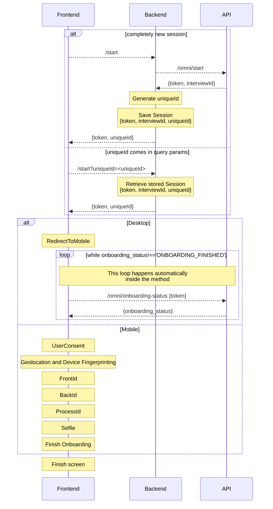

# Onboarding Extended React Example.

This Sample Repository follows the recommended core flow for and Incode's onboarding, you can find a step by step on how this project was created in [Onboading Extended React Integration](https://developer.incode.com/docs/onboarding-extended-react).

We used the default Vite 5 Typescript React Template with some key changes:
* Added https via the `vite-plugin-mkcert`.
* Serve the app in the local network interface instead of just localhost (added --host to the `npm run dev` script).
* Used .env file to configure the project.
* A reverse proxy configuration to serve a backend server from your own localhost

## Backend Server
A backend server that will generate the url is needed for this sample,
luckily for you we already have a sample server for NodeJS, please reffer
to our documentation on subject: [Sample Backend Server](https://developer.incode.com/docs/code-samples-for-web-integrations#backend-sample-server)

In order to simplify development, this repo is configured to reverse
proxy a local backend server (`http://localhost:3000`) in the `/api`
url like `https://<your-ip>:5173/api`, if you want to point your
frontend development to a backend server deployed elsewhere, change
the VITE_TOKEN_SERVER_URL to the full url of such server.

## Install
To install execute the following command in the terminal:
```bash
npm install
```

## Setup
Copy the `sample.env` file into `.env` and fill the variables:

```env
VITE_INCODE_API_URL=https://demo-api.incodesmile.com/0
VITE_TOKEN_SERVER_URL=/api
VITE_LOCAL_SERVER_URL=https://your-ip:port/
```

* The API URL for you is probably going to be the demo one, remember to change it when moving to production.

* You will need to visit this page on your mobile phone, that what the local server url is for, to put in your local IP and the port where vite exposes your project when you run `npm run dev`.

## Run
To run the project execute the following command in the terminal:
```bash
npm run dev
```

## Steps:
This sample implements the following steps.
* RedirectToMobile: Provides a convenient way to move the users to complete onboarding in a mobile phone, it has a QR code and a SMS sending feature.
* UserConsent: Before we start capturing any information we need the users consent
* Geolocation and Device Fingerprinting: Get valuable information about the user that later can be used to apply business rules and fraud prevention.
* FrontId: Captures the front of the ID 
* BackId: Captures the back of the ID 
* ProcessId: Process the information contained in the ID
* Selfie: Takes a picture of the user.
* ProcessFace: Matchs the face of the user with the face in the ID.
* FinishOnboarding: Marks the session as complete and triggers all the postprocessing.

The code is made with renderRedirectToMobile as first step, if it detects that the user is in desktop it will
present renderRedirectToMobile with an `URL` that points to this same file using the `VITE_LOCAL_SERVER_URL`
enviroment variable + a generated `uniqueId` that we received from the call to `/start`.

The `renderRedirectToMobile` has a behaviour where it automatically polls for the status of the session, and
when it detects that the session has finished, it executes the `onSuccess` method to continue.

The URL when opened in mobile will read the `uniqueId` from the query params, and send it to `/start` to continue
the session instead of creating a new one.

The `uniqueId` links both desktop and mobile that are running in parallel to give the best possible experience to
the user.

This diagram explains it in detail:



## Author

© Incode Technologies Inc. All rights reserved.